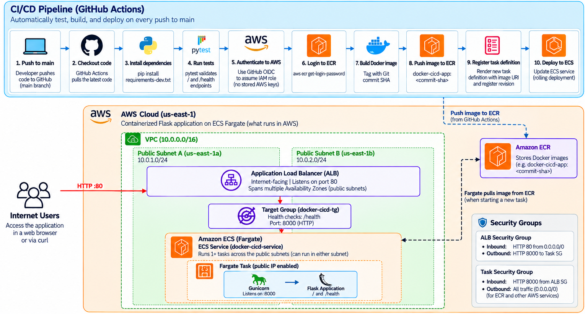

# AWS ECS CI/CD Pipeline

A containerized Python application deployed to Amazon ECS on AWS Fargate through an automated CI/CD pipeline using GitHub Actions.

Every push to `main` triggers automated testing, builds a Docker image, tags the image with the Git commit SHA, pushes it to Amazon ECR, and deploys a new task definition revision to an ECS service behind an Application Load Balancer.

## Architecture



### Application Traffic

Internet users access the application through an internet-facing Application Load Balancer on port 80. The ALB forwards traffic through a target group to the ECS Fargate task on port 8000.

The container runs the Flask application using Gunicorn, while the `/health` endpoint provides health checks for the load balancer.

## CI/CD Pipeline

A push to the `main` branch triggers GitHub Actions:

1. Check out the repository.
2. Install development and testing dependencies.
3. Run automated tests with Pytest.
4. Authenticate to AWS using GitHub OIDC.
5. Log in to Amazon ECR.
6. Build the Docker image and tag it with the Git commit SHA.
7. Push the image to Amazon ECR.
8. Render the ECS task definition with the new image URI.
9. Register the new task definition revision and update the ECS service.
10. Wait for the ECS service to reach a stable state.

If the automated tests fail, the workflow stops before the image is built or deployed.

## Technologies

- AWS ECS
- AWS Fargate
- Amazon ECR
- Application Load Balancer
- AWS IAM
- GitHub Actions
- GitHub OIDC
- Docker
- Python
- Flask
- Gunicorn
- Pytest

## Security

GitHub Actions authenticates to AWS through OpenID Connect (OIDC) rather than storing long-lived AWS access keys as GitHub secrets.

The GitHub Actions IAM role uses scoped permissions for ECR image pushes and ECS deployments, including permission to pass the ECS task execution role.

The Fargate task security group accepts application traffic on port 8000 only from the Application Load Balancer security group.

## Containerization

The Flask application is packaged as a Docker image and served using Gunicorn.

Runtime dependencies are separated from development and testing dependencies:

- `requirements.txt` — Flask and Gunicorn
- `requirements-dev.txt` — runtime dependencies plus Pytest

## Testing

Pytest validates the application's `/` and `/health` endpoints before a deployment can proceed.

I deliberately introduced a failing test during development to verify the pipeline's failure behavior. GitHub Actions stopped at the testing stage before the image build, ECR push, and ECS deployment stages. The previously deployed application remained available while CI was failing.

## Deployment Strategy

Docker images are tagged with the Git commit SHA, providing traceability across the deployment lifecycle:

```text
Git commit → Docker image → ECS task definition → running deployment
```

ECS maintains the desired number of Fargate tasks and performs a rolling deployment when a new task definition revision is released.

The Application Load Balancer uses the `/health` endpoint to determine whether a task is healthy before routing application traffic to it.

## Troubleshooting and Lessons Learned

### GitHub OIDC Authentication

The initial GitHub Actions deployment could not assume the AWS IAM role through OIDC. I corrected the IAM role trust relationship so that only the intended GitHub repository and branch could assume the deployment role.

### IAM PassRole

The ECS deployment initially failed because the GitHub Actions role did not have permission to pass the ECS task execution role. I added scoped `iam:PassRole` permission for the execution role referenced by the task definition.

### ECS Service Configuration

An early deployment referenced an incorrect ECS service name. I identified the active service and corrected the GitHub Actions workflow configuration.

### Fargate Networking

During initial deployment testing, a Fargate task could not retrieve ECR authentication because it lacked a working outbound network path. I corrected the VPC routing and internet connectivity required for the task to communicate with ECR.

### Container Runtime

The application initially used Flask's development server. I replaced it with Gunicorn and verified the new container locally before deploying it through the CI/CD pipeline.

### CI Failure Protection

I intentionally introduced a failing automated test and pushed it to the repository. GitHub Actions stopped at the test stage, preventing the build and deployment steps from executing.

This confirmed that a failed test would not replace the healthy application already running in ECS.

## Local Development

Create and activate a Python virtual environment:

```bash
python3 -m venv .venv
source .venv/bin/activate
```

Install development dependencies:

```bash
pip install -r requirements-dev.txt
```

Run the tests:

```bash
python -m pytest
```

Build the Docker image:

```bash
docker build -t docker-cicd-app .
```

Run the container:

```bash
docker run --rm -p 8000:8000 docker-cicd-app
```

Test the endpoints:

```bash
curl http://localhost:8000/
curl http://localhost:8000/health
```

## What I Learned

This project strengthened my understanding of:

- Container image and container lifecycle management
- CI/CD pipeline design
- Automated testing as a deployment gate
- AWS IAM roles and OIDC federation
- ECS task definitions, tasks, and services
- AWS Fargate networking
- Application Load Balancer health checks
- Security group relationships
- Immutable image tagging and deployment traceability
- Troubleshooting across application, container, networking, IAM, and deployment layers

## Project Status

This application and its infrastructure were built as a hands-on cloud engineering project to demonstrate containerization, automated testing, AWS IAM/OIDC authentication, and automated deployment to Amazon ECS.

Runtime AWS resources may be destroyed after testing and documentation to avoid unnecessary cloud costs.